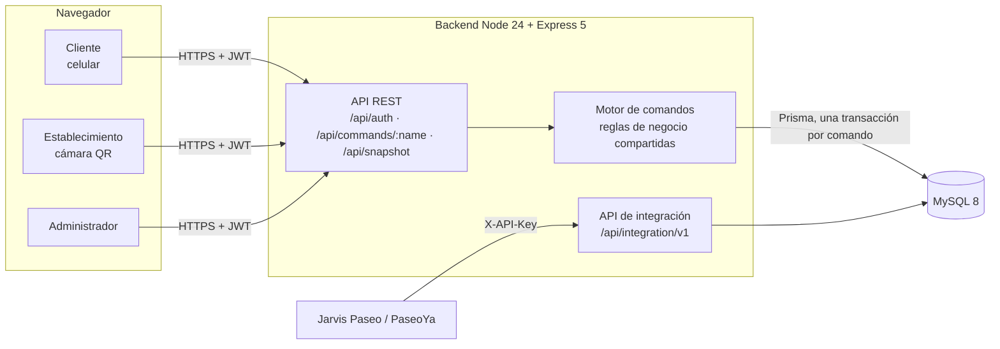

# Paseo Club · Sistema de fidelización de Paseo Aranjuez

Solución al **Reto 1 "Paseo Points"** del *Hackathon by Paseo Aranjuez*: un programa único de puntos que conecta a
todos los establecimientos del Paseo. Cada compra, visita o evento suma puntos que el cliente canjea por beneficios en
cualquier local participante.

> En la interfaz el programa se llama **Paseo Club**; *Paseo Points* es el nombre del proyecto en el código.

## Problema

Hoy un cliente puede comprar en varios locales del Paseo sin que exista un ecosistema digital común. El Paseo no
reconoce su frecuencia de visita, no premia sus compras de forma unificada, no puede personalizar promociones ni
empujarlo a conocer otros negocios, y no genera información sobre hábitos de consumo.

## Solución

Una aplicación web (pensada para el celular del cliente) con tres vistas según el tipo de cuenta:

| Rol | Qué hace |
| --- | --- |
| **Cliente** | Se registra, muestra su QR personal, acumula puntos, sube de nivel, cumple misiones, canjea recompensas y recibe promociones personalizadas. |
| **Establecimiento** | Escanea el QR del cliente, registra la compra con productos de su catálogo, valida canjes y consulta sus movimientos. El encargado crea las recompensas de su local. |
| **Administrador** | Gestiona locales, usuarios, niveles, promociones, misiones, eventos e insignias; configura las reglas de puntos; ve métricas, alertas de fraude y auditoría. |

### Reglas de puntos

- **Bs 1 = 1 punto** (configurable desde *Configuración*), multiplicado por el nivel del cliente y por las
  promociones activas (por ejemplo, puntos dobles en fechas especiales).
- Hay dos saldos: **puntos** (se gastan en recompensas) y **puntos de nivel** (nunca se gastan y definen el nivel).
- Niveles: **Bronce** (desde 0, ×1), **Plata** (1.500, ×1,25), **Oro** (5.000, ×1,5) y **Platinum** (12.000, ×2).
- Recompensas de ejemplo: 300 puntos (descuento Bs 20), 500 (Classic Roll en Cinnabon), 700 (pizza personal),
  1.000 (15 % de descuento, desde Plata) y 1.500 (descuento Bs 100).

## Flujo de la demo (punto 3.10 del reto)

1. El cliente crea su cuenta.
2. Recibe un **código QR personal** (al reverso de su tarjeta, firmado por el servidor y renovado cada 5 minutos, con
   un código de 6 dígitos debajo).
3. Realiza una compra en un establecimiento.
4. El establecimiento **escanea el QR** con la cámara (o escribe el código de 6 dígitos).
5. Se registra la compra con los productos del catálogo del local.
6. Los puntos **aparecen automáticamente** en la cuenta del cliente, sin recargar la página.
7. El cliente revisa los premios disponibles.
8. Selecciona una recompensa y recibe un **token de canje** que vence en 15 minutos.
9. El comercio **valida el canje** escaneando ese token.
10. El sistema registra toda la operación: movimientos de puntos, canje, auditoría y métricas del administrador.

## Cumplimiento del reto

### Requisitos mínimos (3.8)

| Requisito | Dónde está |
| --- | --- |
| Registro e inicio de sesión | `POST /api/auth/register` y `/api/auth/login` · `pages/LoginPage.tsx` |
| Perfil del cliente | `pages/AccountPage.tsx` · `components/MemberCard.tsx` |
| Sistema de puntos | `registerPurchase()` en `data/actions.ts` · `quotePurchase()` en `domain/loyalty.ts` |
| Registro de transacciones | Tablas `Transaction` y `TransactionItem` |
| Historial de puntos | `pages/customer/ActivityPage.tsx` (tablas `PointMovement` y `StatusMovement`) |
| Catálogo de beneficios y canje | `pages/customer/RewardsPage.tsx` · `createRedemption()` / `validateRedemption()` |
| Panel para establecimientos | `pages/merchant/*` (rutas `/merchant/:id`) |
| Panel administrativo | `pages/admin/*` (rutas `/admin`) |
| Identificación del cliente | QR personal firmado + código de 6 dígitos · `POST /api/customers/identify` |
| Base de datos | MySQL 8 con Prisma · `backend/prisma/schema.prisma` · `docs/DATABASE.md` |

### Funcionalidades adicionales (3.9)

- **Niveles** Bronce, Plata, Oro y Platinum, con multiplicador de puntos.
- **Misiones y retos** con fecha de inicio y fin (ruta gastronómica, explorador, constancia semanal, etc.).
- **Pasaporte del Paseo**: bono por comprar por primera vez en cada local.
- **Puntos dobles en fechas especiales**: promociones con multiplicador por fechas, local o categoría.
- **Puntos y regalos de cumpleaños**, con verificación de la fecha de nacimiento.
- **Ranking de clientes**: top 10 por puntos de nivel ganados en los últimos 30 días, más la posición propia
  (canjear no baja de puesto). En el panel del administrador, **clientes frecuentes** y **establecimientos con
  mayor actividad**.
- **Logros e insignias**, **ruleta**, **tarjeta de visitas** y **rachas semanales** (gamificación).
- **Check-in en espacios del Paseo** (galería, miradores) con QR fijo.
- **Cupones digitales** (token de canje y cupones personales de un solo uso).
- **Notificaciones** dentro de la aplicación.
- **Promociones personalizadas automáticas**: el sistema detecta clientes que dejaron de venir y les crea una
  promoción en la categoría que más consumen; también por aniversario de la cuenta.
- **Estadísticas**: ventas por día, tráfico por piso y categoría, horas pico, efectividad de promociones, compras
  compartidas entre tiendas y exportación a CSV.
- **Detección de fraude**: compra duplicada, monto anormal, alta frecuencia, canje reutilizado y solo check-ins. Una
  compra sospechosa queda retenida sin puntos hasta que el administrador la revise.

## Arquitectura



- **Reglas de negocio en un solo lugar.** `frontend/src/data/actions.ts` y `frontend/src/domain/loyalty.ts` son
  TypeScript puro (sin React). El backend los importa y los ejecuta; el frontend los usa solo para mostrar datos.
- **Comandos.** Cada escritura es un comando (`POST /api/commands/:name`). El servidor identifica al usuario por su
  JWT, ejecuta la regla y guarda todos los cambios en **una sola transacción** de MySQL. Las escrituras aceptan
  `Idempotency-Key`, así un reintento no duplica una compra.
- **Tiempo real.** Los clientes consultan `GET /api/snapshot?since=<versión>` cada pocos segundos; si nada cambió
  el servidor responde 204. Así los puntos aparecen en el celular del cliente apenas el comercio registra la compra.
- **Historial inmutable.** Los saldos nunca se guardan: se calculan sumando los movimientos. Las correcciones son
  movimientos nuevos (anulación o ajuste), nunca ediciones.
- **Privacidad.** Un cliente no recibe el correo, teléfono ni fecha de nacimiento de otros usuarios, ni sus tokens de
  canje.
- **Integración.** API de solo lectura documentada con OpenAPI (`/api/integration/v1/openapi.json`) para que Jarvis
  Paseo (asistente con IA) y PaseoYa consulten locales, catálogo, promociones, recompensas y saldo de clientes.

## Tecnologías

| Capa | Tecnología |
| --- | --- |
| Frontend | React 19, Vite, TypeScript, React Router 7, `qrcode.react`, `qr-scanner`, `lucide-react`, CSS propio |
| Backend | Node 24, Express 5, TypeScript (`tsx`), JWT, bcrypt |
| Base de datos | MySQL 8 (InnoDB, utf8mb4), Prisma 6 con migraciones versionadas |
| Despliegue | El backend sirve el frontend compilado; MySQL local o en la nube (Aiven, con SSL) |

## Estructura

```
backend/
  prisma/          schema.prisma, migraciones y seed
  src/             server.ts (rutas), engine.ts (comandos), auth.ts, integration.ts, openapi.ts
frontend/
  src/data/        actions.ts (reglas), commands.ts, store.ts, fixtures.ts (datos de demo)
  src/domain/      loyalty.ts, engagement.ts, metrics.ts (cálculos puros)
  src/pages/       customer/, merchant/, admin/
database/          paseo_points.sql (dump de la base)
docs/              DATABASE.md (modelo de datos)
start-demo.ps1     levanta todo para la demo
```

## Cómo ejecutarlo

Requisitos: **Node 24** y **MySQL 8**.

1. Crea `backend/.env` a partir de `backend/.env.example` y completa `DATABASE_URL` y `JWT_SECRET`. Para poder
   restablecer los datos desde la interfaz, pon `ALLOW_DEMO_RESET=true`.
2. Desde la raíz, en PowerShell:

   ```powershell
   .\start-demo.ps1 -Reset   # migra la base, carga los datos de demo, compila el frontend y arranca
   ```

3. Abre <http://localhost:4000>. Desde un celular en la misma red: `http://<IP-de-la-PC>:4000`.

Sin el script:

```bash
cd backend && npm install && npm run db:setup && npm start     # API + base de datos en :4000
cd frontend && npm install && npm run dev                      # interfaz con recarga en https://localhost:5173
```

La cámara del celular solo funciona con HTTPS fuera de `localhost`; `npm run dev` sirve HTTPS con un certificado
autofirmado.

### Cuentas de demo

Contraseña de todas: **`demo1234`**.

| Correo | Rol |
| --- | --- |
| `ana@demo.paseo` | Cliente, nivel Plata |
| `camila@demo.paseo` | Cliente |
| `marco@demo.paseo` | Cliente con una compra duplicada (genera alerta de fraude) |
| `luis@demo.paseo` | Encargado de Mocca Café |
| `sofia@demo.paseo` | Encargada de Gap |
| `carla@demo.paseo` | Personal de Farmacorp |
| `admin@demo.paseo` | Administrador del programa |

Los datos de demo usan 14 marcas reales del Paseo con sus horarios reales. Los pisos de Cinnabon, Farmacorp, Impulse,
el Paseo de Comidas y El 4to están confirmados; el resto de ubicaciones, precios, clientes y compras son ilustrativos.

## Posible implementación en el Paseo

1. **Piloto** con 10 a 15 locales del Paseo de Comidas y El 4to, donde la ruta gastronómica y el Pasaporte llevan
   tráfico a los pisos superiores.
2. **Despliegue** del backend en un servidor con MySQL administrado; el personal usa el celular o la tablet del local
   como lector de QR, sin hardware adicional.
3. **Integración** con Jarvis Paseo (recomienda) y PaseoYa (vende con retiro en tienda) mediante la API de
   integración: la compra en línea también suma puntos y el retiro trae al cliente al Paseo.
4. **Eventos** como la Feria del Descuento se vuelven medibles: quién vino, qué compró y qué promoción funcionó.
