# Paseo Points — Base de datos

Modelo relacional MySQL 8+ (InnoDB, `utf8mb4`) gestionado con Prisma (`backend/prisma/schema.prisma`).
Normalizado hasta 3FN: cada tabla describe una sola entidad o relación, no se guarda información derivable
y los datos relacionados se obtienen mediante FK y JOIN.

- IDs: `Int @id @default(autoincrement())` en todas las entidades. Las tablas puente usan clave primaria compuesta.
- Dinero: `DECIMAL(10,2)` en Bs (`Transaction.amount`, `TransactionItem.unitPrice`, `CatalogItem.price`,
  `Promotion.value`, `Reward.discountAmount`, `Reward.minimumPurchase`). Nunca `FLOAT`. `CatalogItem.price` es
  obligatorio (`NOT NULL`) porque las compras se registran eligiendo productos del catálogo.
- Puntos (`PointMovement`) y puntos de nivel (`StatusMovement`): enteros (`INT`), positivos o negativos en sus
  libros de movimientos (ledgers).

Vocabulario: en código y base de datos se mantienen los nombres en inglés (`Points`, `Status`, `Tier`, `MANAGER`,
`STAFF`); en la interfaz se muestran como **puntos**, **puntos de nivel**, **nivel**, **Encargado** y **Personal**.

## Tablas

| # | Tabla | PK | FK | UNIQUE / índices |
|---|-------|----|----|------------------|
| 1 | User | id | — | email UNIQUE |
| 2 | Business | id | — | — |
| 3 | BusinessSchedule | id | businessId → Business | (businessId, dayOfWeek) UNIQUE |
| 4 | BusinessMember | id | userId → User, businessId → Business | userId UNIQUE, businessId |
| 5 | Category | id | parentId → Category | parentId |
| 6 | BusinessCategory | (businessId, categoryId) | businessId → Business, categoryId → Category | categoryId |
| 7 | CatalogItem | id | businessId → Business | businessId |
| 8 | Tier | id | — | name UNIQUE, minimumStatus UNIQUE |
| 9 | Transaction | id | customerId → User, businessId → Business, performedById → User | customerId, businessId, createdAt |
| 10 | PointMovement | id | userId → User, transactionId? → Transaction, redemptionId? → Redemption, missionId? → Mission, promotionId? → Promotion, eventId? → Event | userId, createdAt |
| 11 | StatusMovement | id | userId → User, transactionId? → Transaction, missionId? → Mission | userId |
| 12 | Reward | id | businessId → Business, catalogItemId? → CatalogItem, minimumTierId? → Tier, createdById → User | businessId |
| 13 | Redemption | id | userId → User, rewardId → Reward, businessId? → Business, validatedById? → User | verificationToken UNIQUE, userId |
| 14 | Mission | id | createdById → User | — |
| 15 | MissionBusiness | (missionId, businessId) | Mission, Business | businessId |
| 16 | MissionCategory | (missionId, categoryId) | Mission, Category | categoryId |
| 17 | MissionProgress | (missionId, userId) | Mission, User | userId |
| 18 | BusinessDiscovery | (userId, businessId) | User, Business | businessId (userId cubierto por la PK) |
| 19 | Promotion | id | createdById → User | — |
| 20 | PromotionBusiness | (promotionId, businessId) | Promotion, Business | businessId |
| 21 | PromotionCategory | (promotionId, categoryId) | Promotion, Category | categoryId |
| 22 | Event | id | createdById → User | — |
| 23 | EventAttendance | (eventId, userId) | eventId → Event, userId → User, checkedInById → User | userId |
| 24 | Badge | id | tierId? → Tier, categoryId? → Category, createdById → User | — |
| 25 | FraudAlert | id | transactionId? → Transaction, redemptionId? → Redemption | status |
| 26 | AuditLog | id | userId → User | userId |
| 27 | SystemSetting | key | — | — |
| 28 | TransactionItem | id | transactionId → Transaction, catalogItemId → CatalogItem | transactionId, catalogItemId |
| 29 | CancellationRequest | id | transactionId → Transaction, requestedById → User, reviewedById? → User | transactionId UNIQUE, status |
| 30 | Notification | id | userId → User | userId |

Además de los índices listados, MySQL exige un índice en cada columna FK; Prisma los declara explícitamente.

## Relaciones y cardinalidades

- **`User.role`** distingue los tres tipos de cuenta del reto: CUSTOMER (cliente), MERCHANT (personal de un
  establecimiento) y ADMIN (administración del Paseo). El personal usa una cuenta propia, distinta a la de cliente.
- **User 1:0..1 BusinessMember N:1 Business** — solo cuentas MERCHANT; cada una trabaja en un único establecimiento
  (`userId` UNIQUE) con `role` MANAGER (encargado) o STAFF (personal) y `status`.
- **Business 1:N BusinessSchedule** — máximo una fila por día (`businessId + dayOfWeek`).
- **Business N:M Category** vía `BusinessCategory`.
- **Category 1:N Category** (auto-relación `parentId`) — jerarquía categoría / subcategoría.
- **Business 1:N CatalogItem**.
- **User 1:N Transaction** (como cliente, `customerId`) y **User 1:N Transaction** (como empleado, `performedById`).
- **Business 1:N Transaction**.
- **User 1:N PointMovement**, **User 1:N StatusMovement**.
- **Transaction 1:N PointMovement / StatusMovement** (una compra puede generar puntos base + bonus de promoción y puntos de nivel).
- **Redemption 1:N PointMovement** (el débito del canje y, si se cancela, su reverso).
- **Mission 1:N PointMovement / StatusMovement**, **Promotion 1:N PointMovement**, **Event 1:N PointMovement**.
- **Business 1:N Reward** — cada recompensa es de un solo establecimiento, la crea su encargado y solo se canjea ahí.
  Sus condiciones son columnas tipadas según `type`: `PERCENT_DISCOUNT` (`discountPercent`), `AMOUNT_DISCOUNT`
  (`discountAmount`), `FREE_PRODUCT` (`catalogItemId` del catálogo del mismo negocio + `quantity`); `minimumPurchase`
  es opcional. `description` solo agrega aclaraciones.
- **Tier 1:N Reward** (`minimumTierId`, opcional).
- **Event N:M User** vía `EventAttendance` (quién ingresó, quién registró el ingreso y cuándo). Un ingreso por cliente y evento.
- **Tier / Category 1:N Badge** (según el tipo de insignia).
- **User 1:N Redemption** (cliente) y **User 1:N Redemption** (validador, opcional). **Reward 1:N Redemption**. **Business 1:N Redemption** (opcional).
- **Mission N:M Business / Category** (`MissionBusiness`, `MissionCategory`).
- **Mission N:M User** vía `MissionProgress` (con `progress`, `completedAt`).
- **User N:M Business** vía `BusinessDiscovery` (Paseo Passport).
- **Promotion N:M Business / Category** (`PromotionBusiness`, `PromotionCategory`).
- **Transaction 1:N FraudAlert**, **Redemption 1:N FraudAlert**.
- **User 1:N AuditLog**; **User 1:N Reward / Mission / Promotion / Event / Badge** (`createdById`).
- **Transaction 1:N TransactionItem N:1 CatalogItem** — las líneas de la compra (producto, `quantity`, `unitPrice`
  copiado del catálogo al registrar). `Transaction.amount` es la suma de las líneas y se guarda por ser el valor
  histórico real, igual que `unitPrice` no depende del precio actual del producto.
- **Transaction 1:0..1 CancellationRequest** — solo el encargado pide anular una compra que ya no puede deshacer
  (el registro se puede deshacer durante 2 minutos). La administración la aprueba (la compra pasa a `CANCELLED` y el
  cliente recibe una `Notification` con el motivo) o la rechaza (el encargado ve `reviewNote`). Una solicitud por
  compra (`transactionId` UNIQUE).
- **User 1:N Notification** — avisos al cliente (p. ej. puntos descontados por una anulación); `readAt` marca
  cuándo los descartó.

Una misión o promoción sin filas en sus tablas `*Business` / `*Category` se considera global.

## Puntos vs puntos de nivel

| | Puntos (`Points`) | Puntos de nivel (`Status`) |
|---|--------|--------|
| Uso | Se gastan en recompensas | Progreso de nivel; no se gastan |
| Ledger | `PointMovement` | `StatusMovement` |
| Total | `SUM(PointMovement.amount)` por usuario | `SUM(StatusMovement.amount)` por usuario |
| Signo | + compras, misiones, promociones, eventos; − canjes, reversos | + compras, misiones, descubrimientos, rachas; ajustes ± |

Son ledgers (libros de movimientos) separados: un canje reduce los puntos pero nunca los puntos de nivel, y por
tanto no baja el nivel.

**Nivel actual**: el `Tier` activo con mayor `minimumStatus` que sea `<= SUM(StatusMovement.amount)` del usuario.

## Información calculada (no almacenada)

| Dato | Cómo se obtiene |
|------|-----------------|
| Saldo de puntos | `SUM(PointMovement.amount)` |
| Puntos de nivel acumulados | `SUM(StatusMovement.amount)` |
| Nivel actual | Puntos de nivel comparados con `Tier.minimumStatus` |
| Puntos de una compra | Movimientos con ese `transactionId` |
| Insignias obtenidas | Se evalúa cada `Badge` contra el historial (compras completadas, `StatusMovement`, `MissionProgress`, `EventAttendance`) más una insignia por cada `EventAttendance`. Si se anula la compra que la dio, desaparece sola |
| Fecha en que se obtuvo una insignia | La compra, movimiento o ingreso que cumplió la condición |
| Métricas (ticket promedio, recurrencia, tasa de canje, horas pico…) | Consultas agregadas sobre `Transaction`, ledgers, `Redemption` y `EventAttendance` |
| Categorías descubiertas (Passport) | `BusinessDiscovery → BusinessCategory → Category` |
| Nº de negocios descubiertos, progreso por categoría | Conteos sobre `BusinessDiscovery` + `BusinessCategory` |
| Racha semanal actual / mejor racha | Semanas consecutivas con al menos una `Transaction` `COMPLETED` |
| Usuario / negocio de una alerta de fraude | Vía `Transaction` o `Redemption` |
| Stock restante de una recompensa | `Reward.stock − COUNT(Redemption)` no canceladas |

Se almacena `Redemption.pointsSpent` a propósito: es el valor histórico real del canje y no depende del precio
actual de `Reward`. Lo mismo aplica a `Transaction.amount`.

`MissionProgress` es la única excepción controlada: representa el estado propio del usuario respecto a una misión.
La recompensa se entrega automáticamente al completarla (por eso no existe `rewardClaimed`). En misiones
`TOTAL_PURCHASE_AMOUNT`, `goal` y `progress` se expresan en Bs enteros. Si se anula una compra y el objetivo deja de
cumplirse, la misión vuelve a quedar pendiente y su premio se descuenta con movimientos `REVERSAL` / `ADJUSTMENT`.

Un `Redemption` `PENDING` vence a los `REDEMPTION_EXPIRATION_MINUTES` (`SystemSetting`, 15 por defecto) desde
`createdAt`: el servidor revisa cada 15 s, lo pasa a `EXPIRED` y devuelve los puntos con un movimiento `REVERSAL`.

`Badge.date` (insignias `SPECIAL_DATE`) es un día calendario de Bolivia (UTC−4): vale de 00:00 a 23:59 de ese día y
se gana con una compra completada o un ingreso a evento en esa fecha.

## Soft delete y política de borrado

**Soft delete (`deletedAt`)** solo en entidades administrables: `User`, `Business`, `Category`, `CatalogItem`,
`Reward`, `Mission`, `Promotion`, `Event`, `Badge`. Las consultas de la aplicación deben filtrar `deletedAt IS NULL`.
`status` (ACTIVE / INACTIVE…) es independiente: permite ocultar temporalmente sin eliminar.

**Historial inmutable, sin soft delete ni borrado físico**: `Transaction`, `TransactionItem`, `PointMovement`,
`StatusMovement`, `Redemption`, `EventAttendance`, `FraudAlert`, `CancellationRequest`, `AuditLog`. Las correcciones se hacen con movimientos nuevos (`REVERSAL`,
`ADJUSTMENT`) o cambiando `status` (`CANCELLED`, `FLAGGED`), nunca editando ni borrando filas.

**Reglas `ON DELETE`**:

- `RESTRICT` en toda FK desde historial (Transaction, TransactionItem, ledgers, Redemption, EventAttendance,
  FraudAlert, CancellationRequest, AuditLog) y en
  `createdById`, `CatalogItem.businessId`, `Reward.businessId`, `Reward.catalogItemId`, `Reward.minimumTierId`,
  `Badge.tierId`, `Badge.categoryId`, `Category.parentId`. Un `DELETE` físico de User o Business con historial falla
  en lugar de destruirlo.
- `CASCADE` solo en tablas puente y estado dependiente: `BusinessCategory`, `Mission/PromotionBusiness`,
  `Mission/PromotionCategory`, `BusinessSchedule`, `BusinessMember`, `MissionProgress`, `BusinessDiscovery`,
  `Notification`.

## Tablas excluidas a propósito

`LoyaltyAccount`, `UserPoints`, `UserTier` (balances / tier derivables), `UserBadge` (derivable del historial),
`Referral` (fuera de alcance por ahora), `PassportCategoryDiscovery`
(derivable de `BusinessDiscovery`), `Streak` (derivable de `Transaction`), `Recommendation`, `Analytics`,
`Dashboard` (se calculan), `QRSession` (token firmado), `Tag`, `BusinessTag` (fuera del MVP).

## Diagrama ER

```mermaid
erDiagram
    User ||--o{ BusinessMember : "pertenece"
    Business ||--o{ BusinessMember : "emplea"
    Business ||--o{ BusinessSchedule : "horario"
    Business ||--o{ BusinessCategory : ""
    Category ||--o{ BusinessCategory : ""
    Category ||--o{ Category : "parentId"
    Business ||--o{ CatalogItem : "ofrece"

    User ||--o{ Transaction : "customerId"
    User ||--o{ Transaction : "performedById"
    Business ||--o{ Transaction : "registra"

    User ||--o{ PointMovement : ""
    Transaction |o--o{ PointMovement : ""
    Redemption |o--o{ PointMovement : ""
    Mission |o--o{ PointMovement : ""
    Promotion |o--o{ PointMovement : ""
    Event |o--o{ PointMovement : ""

    User ||--o{ StatusMovement : ""
    Transaction |o--o{ StatusMovement : ""
    Mission |o--o{ StatusMovement : ""

    Business ||--o{ Reward : "businessId"
    CatalogItem |o--o{ Reward : "catalogItemId"
    Tier |o--o{ Reward : "minimumTierId"
    User ||--o{ Reward : "createdById"

    User ||--o{ Event : "createdById"
    Event ||--o{ EventAttendance : ""
    User ||--o{ EventAttendance : "userId"
    User ||--o{ EventAttendance : "checkedInById"

    User ||--o{ Badge : "createdById"
    Tier |o--o{ Badge : "tierId"
    Category |o--o{ Badge : "categoryId"

    User ||--o{ Redemption : "userId"
    User |o--o{ Redemption : "validatedById"
    Reward ||--o{ Redemption : ""
    Business |o--o{ Redemption : ""

    User ||--o{ Mission : "createdById"
    Mission ||--o{ MissionBusiness : ""
    Business ||--o{ MissionBusiness : ""
    Mission ||--o{ MissionCategory : ""
    Category ||--o{ MissionCategory : ""
    Mission ||--o{ MissionProgress : ""
    User ||--o{ MissionProgress : ""

    User ||--o{ BusinessDiscovery : ""
    Business ||--o{ BusinessDiscovery : ""

    User ||--o{ Promotion : "createdById"
    Promotion ||--o{ PromotionBusiness : ""
    Business ||--o{ PromotionBusiness : ""
    Promotion ||--o{ PromotionCategory : ""
    Category ||--o{ PromotionCategory : ""

    Transaction |o--o{ FraudAlert : ""
    Redemption |o--o{ FraudAlert : ""
    User ||--o{ AuditLog : ""

    Transaction ||--o{ TransactionItem : "líneas"
    CatalogItem ||--o{ TransactionItem : ""
    Transaction ||--o| CancellationRequest : ""
    User ||--o{ CancellationRequest : "requestedById"
    User |o--o{ CancellationRequest : "reviewedById"
    User ||--o{ Notification : ""

    User {
        int id PK
        string email UK
        string passwordHash
        string firstName
        string lastName
        string phone
        date birthDate
        enum role
        enum status
        datetime deletedAt
    }
    Business {
        int id PK
        string name
        text description
        string logoUrl
        string phone
        string floor
        string sector
        string localNumber
        enum status
        datetime deletedAt
    }
    BusinessSchedule {
        int id PK
        int businessId FK
        enum dayOfWeek
        time openTime
        time closeTime
        bool isClosed
    }
    BusinessMember {
        int id PK
        int userId FK
        int businessId FK
        enum role
        enum status
    }
    Category {
        int id PK
        string name
        int parentId FK
        enum status
        datetime deletedAt
    }
    BusinessCategory {
        int businessId PK, FK
        int categoryId PK, FK
    }
    CatalogItem {
        int id PK
        int businessId FK
        string name
        text description
        decimal price
        bool isAvailable
        datetime deletedAt
    }
    Tier {
        int id PK
        string name UK
        int minimumStatus UK
        decimal pointsMultiplier
        int sortOrder
        bool isActive
    }
    Transaction {
        int id PK
        int customerId FK
        int businessId FK
        int performedById FK
        decimal amount
        enum status
        datetime createdAt
    }
    PointMovement {
        int id PK
        int userId FK
        int transactionId FK
        int redemptionId FK
        int missionId FK
        int promotionId FK
        int eventId FK
        enum type
        int amount
        datetime createdAt
    }
    StatusMovement {
        int id PK
        int userId FK
        int transactionId FK
        int missionId FK
        enum type
        int amount
        datetime createdAt
    }
    Reward {
        int id PK
        int businessId FK
        enum type
        int discountPercent
        decimal discountAmount
        int catalogItemId FK
        int quantity
        decimal minimumPurchase
        text description
        int pointsCost
        int minimumTierId FK
        int stock
        datetime startsAt
        datetime endsAt
        enum status
        int createdById FK
        datetime deletedAt
    }
    Event {
        int id PK
        string name
        text description
        string location
        datetime startsAt
        datetime endsAt
        int pointsReward
        enum status
        int createdById FK
        datetime deletedAt
    }
    EventAttendance {
        int eventId PK, FK
        int userId PK, FK
        int checkedInById FK
        datetime checkedInAt
    }
    Badge {
        int id PK
        string name
        text description
        enum type
        int goal
        int tierId FK
        int categoryId FK
        date date
        enum status
        int createdById FK
        datetime deletedAt
    }
    Redemption {
        int id PK
        int userId FK
        int rewardId FK
        int businessId FK
        int validatedById FK
        int pointsSpent
        string verificationToken UK
        enum status
        datetime createdAt
        datetime redeemedAt
    }
    Mission {
        int id PK
        string name
        enum type
        int goal
        int rewardPoints
        int rewardStatus
        datetime startsAt
        datetime endsAt
        enum status
        int createdById FK
        datetime deletedAt
    }
    MissionBusiness {
        int missionId PK, FK
        int businessId PK, FK
    }
    MissionCategory {
        int missionId PK, FK
        int categoryId PK, FK
    }
    MissionProgress {
        int missionId PK, FK
        int userId PK, FK
        int progress
        datetime completedAt
    }
    BusinessDiscovery {
        int userId PK, FK
        int businessId PK, FK
        datetime discoveredAt
    }
    Promotion {
        int id PK
        string name
        enum type
        decimal value
        datetime startsAt
        datetime endsAt
        enum status
        int createdById FK
        datetime deletedAt
    }
    PromotionBusiness {
        int promotionId PK, FK
        int businessId PK, FK
    }
    PromotionCategory {
        int promotionId PK, FK
        int categoryId PK, FK
    }
    FraudAlert {
        int id PK
        int transactionId FK
        int redemptionId FK
        enum type
        int riskScore
        enum status
        datetime createdAt
    }
    AuditLog {
        int id PK
        int userId FK
        string action
        string entityType
        int entityId
        datetime createdAt
    }
    SystemSetting {
        string key PK
        string value
        datetime updatedAt
    }
    TransactionItem {
        int id PK
        int transactionId FK
        int catalogItemId FK
        int quantity
        decimal unitPrice
    }
    CancellationRequest {
        int id PK
        int transactionId FK, UK
        int requestedById FK
        text reason
        enum status
        int reviewedById FK
        text reviewNote
        datetime createdAt
        datetime reviewedAt
    }
    Notification {
        int id PK
        int userId FK
        string title
        text message
        datetime createdAt
        datetime readAt
    }
```

